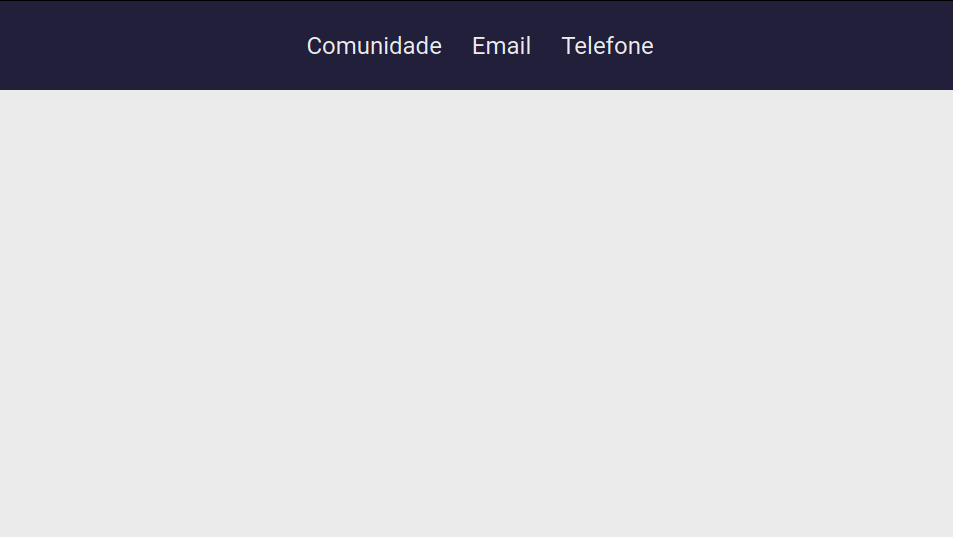

<h2 align="center">
  Desafio 2-1 Primeiro HTML
</h2>

<p align="center">
    
</p>

<p align="center">
  
  
  <a href="license.md">
  
  </a>
</p>

___

<h3 align="center">
  <a href="#pushpin-teoria-aplicada">Teoria</a>&nbsp;|&nbsp;
  <a href="#rocket-desafios-propostos">Desafios</a>&nbsp;|&nbsp;
  <a href="#memo-licença">Licença</a>
</h3>

___

<br>

##  :pushpin: Teoria Aplicada
<br>

### Links

O **link** é que uma função do HTML que permite inserir os hiperlinks em diversos elementos, como textos e imagens. 

Um link precisa sempre apontar para uma URL existente, caso contrário, você poderá obter uma mensagem de erro 404.

*Sintaxe*
```html
<a href="url">Exemplo</a>
```

*Atributo **href***
É o atributo principal da tag \<a> que redireciona o usuário a outro documento ou recurso.

Um *link* pode ser:
- interno: redireciona para um elemento existente dentro da mesma página;
- local: utilizados para páginas contendo o mesmo domínio, ou seja, entre páginas do mesmo site;
- global: utilizados para páginas de outros domínios, ou seja, fora do site.

```html
Interno - <a href="#contato">Contato</a>

Local - <a href="../pages/pagina2.html">Pagina 2</a>

Global - <a href="http://www.google.com/">Google</a>

```

*Atributo **target***
Esse atributo informa ao navegador como o redirecionamento deverá ocorrer, abrindo a página na mesma janela/aba do navegador ou abrindo uma nova janela/aba.

Os atributos *target* são:
- _blank: abre a página em uma nova janela/aba;
- _self: abre a página na mesma janela;
- _parent: abre a página na mesma janela do link;
- _top: cancela todos os demais frames e abre a nova página no mesmo navegador.

```html
<a href="https://www.google.com/" target="_blank">
  Página inicial do Google
</a>
```

*Atributo **title***
Permite escrever um texto que aparecerá apenas quando passarmos o mouse por cima do link.

<br>

### Favicon

Favicon é um ícone exibido ao lado do nome do site na barra de endereços.

Existem vários sites que convertem as imagens .JPG, .GIF ou .PNG em .ICO.

Além de converter a imagem é necessário incluir no *head* do seu html o seguinte *link*:

```html 
<link rel="icon" href="favicon.ico" type="image/x-icon" />
```
<br>

## 🚀 Desafio Proposto

<br>
Criar um arquivo html que contenha um favicon e um header com 3 links: Comunidade, Email e Telefone.
<br><br>

**Critérios Obrigatórios:**

*Links*
- Comunidade: Link que deve apontar para o convite da comunidade aberta da rocketseat (https://discordapp.com/invite/gCRAFhc).

- Email: Link que deve chamar o comando de enviar email para o destinatário oi@rocketseat.com.br. 

- Telefone: Link que deve chamar o comando de realizar uma ligação para o número +5547992078767. 

*Estilização*
- Deve ser aplicado um background
- Deve ser utilizada a fonte Roboto
- O header precisa ocupar todo o espaço lateral e superior 
- O header precisa ter um espaçamento interno de 30px em todas as direções
- Os links devem ter um espaçamento de 30px entre si

*Resultado*
<p align="center">
    
</p>

<br>

##  :memo: Licença 

Esse projeto está sob a licença MIT. Veja o arquivo [LICENSE](LICENSE) para mais detalhes.

<br>

<p align="center">
    <a href=".." >
        
    </a>
</p>
